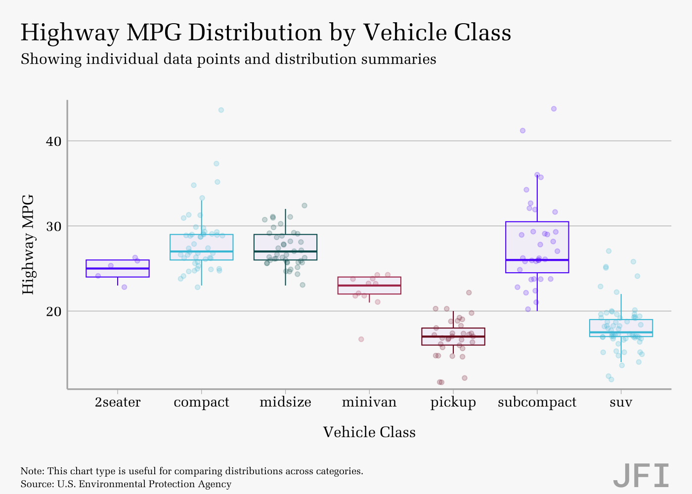
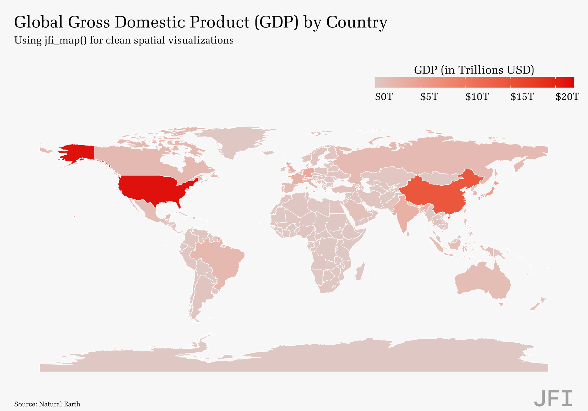

JFITheme: A ggplot2 Theme for JFI
================

**JFITheme** is an R package that provides a complete ecosystem for
creating `ggplot2` visualizations that align with the style guide of
JFI. It includes themes, color palettes, and a suite of high-level
functions to make plot creation quick, easy, and consistent.

## Installation

You can install the development version of `JFITheme` from GitHub with:

``` r
# install.packages("devtools")
devtools::install_github("JainFamilyInstitute/JFITheme")
```

**Note for Map Users:** The mapping examples require the `sf` package.
This package may have system dependencies (like GDAL, GEOS, and PROJ)
that need to be installed first. Please see the [`sf` installation
guide](https://r-spatial.github.io/sf/#installing) for details.

## Core Features

- **Chart Functions:** High-level functions (`jfi_bar`, `jfi_donut`,
  `jfi_map`, etc.) that automatically handle complex styling and
  labeling.
- **Color Palettes:** A set of discrete and continuous color scales
  (`jfi_scale_color_d`, `jfi_scale_fill_c`, etc.).
- **Plot Saving:** A `jfi_save()` function with presets for saving plots
  at the correct size and resolution.

## Usage Examples

### Basic Usage with `jfi_plot()`

For full control over your plot, you can start with `jfi_plot()` and add
`ggplot2` layers manually. This is the most flexible approach and
automatically applies the JFI theme.

``` r
# Data: US Personal Consumption Expenditures
jfi_plot(economics, aes(x = date, y = pce)) +
  geom_line() +
  scale_y_continuous(limits = c(0,NA), expand = c(0,0)) +
  labs(
    title = "US Personal Consumption Expenditures",
    subtitle = "A basic plot using the core jfi_plot() function",
    x = "Year",
    y = "Expenditures (in Billions of USD)",
    caption = source_note(source = "Federal Reserve Economic Data (FRED)")
  )
```

<!-- -->

### Standard Charts

The high-level chart functions are the easiest way to get started. They
automatically apply the theme and handle common styling needs.

#### Bar Chart (`jfi_bar`)

The `jfi_bar` function automatically adds formatted labels to the top of
each bar.

``` r
# Data: Average US unemployment since 2000
df_unemployment <- economics %>%
  filter(year(date) >= 2000) %>%
  mutate(year = year(date)) %>%
  group_by(year) %>%
  summarise(avg_unemployment = mean(unemploy))

jfi_bar(
  df_unemployment, 
  aes(x = year, y = avg_unemployment),
  label_type = "number", 
  label_scale = 1e-3, 
  label_suffix = "k"
) +
  labs(
    title = "Average US Unemployment Since 2000",
    subtitle = "Labels are automatically added and formatted",
    x = "Year",
    y = "Average Unemployed (in thousands)",
    caption = source_note(source = "Federal Reserve Economic Data (FRED)")
  )
```

<!-- -->

#### Stacked Bar Chart (`jfi_bar_stacked`)

The `jfi_bar_stacked` function automatically adds percentage labels with
text color that adjusts for contrast.

``` r
# Data: Composition of the Texas housing market
df_housing_stacked <- txhousing %>%
  filter(year >= 2010, !is.na(sales)) %>%
  mutate(market = fct_lump_n(city, n = 4, w = sales, other_level = "Other")) %>%
  group_by(year, market) %>%
  summarise(total_sales = sum(sales, na.rm = TRUE))

jfi_bar_stacked(
  df_housing_stacked, 
  palette = "pw_blue",
  aes(x = year, y = total_sales, fill = market)
) +
  scale_y_continuous(labels = scales::label_number(scale = 1e-3, suffix = "K"),
                     expand = expansion(mult = c(0, 0.03))) +
  labs(
    title = "Texas Housing Market Composition Over Time",
    subtitle = "Showing sales volume for the top 4 markets vs. the rest of the state",
    x = "Year",
    y = "Total Sales Volume",
    fill = "Market",
    caption = source_note(source = "Texas A&M Real Estate Center")
  )
```

<!-- -->

#### Point-Line Chart (`jfi_point_line`)

``` r
# Data: Personal savings rate from 2000-2005
df_psavert <- economics %>%
  filter(year(date) >= 2000 & year(date) <= 2005)

jfi_point_line(df_psavert, aes(x = date, y = psavert)) +
  labs(
    title = "US Personal Savings Rate (2000-2005)",
    subtitle = "Showing individual data points in a time series",
    x = "Date", y = "Personal Savings Rate (%)",
    caption = source_note(
      source = "Federal Reserve Economic Data (FRED)",
      note = "Point-line charts are useful for visualizing trends over a continuous period."
    )
  )
```

<!-- -->

### Specialized Charts

#### Donut Chart (`jfi_donut`)

The `jfi_donut` function automatically calculates percentages and places
labels with contrast-aware colors. The legend is placed inside the hole
by default.

``` r
# Data: Distribution of Texas housing sales by city in 2014
df_housing <- txhousing %>%
  filter(year == 2015) %>%
  group_by(city) %>%
  summarise(total_sales = sum(sales, na.rm = TRUE)) %>%
  slice_max(order_by = total_sales, n = 5)


p_donut <- jfi_donut(df_housing, aes(y = total_sales, fill = city),
          palette = "pw_blue") +
  labs(
    title = "Top 5 Texas Housing Markets by Sales (2015)",
    subtitle = "A specialized function for creating styled donut charts",
    caption = source_note(
      source = "Texas A&M Real Estate Center"
    )
  )

print_donut(p_donut)
```

<!-- -->

#### Scatter + Box Plot (`jfi_scatter_box`)

This chart is excellent for showing both the distribution summary and
the underlying data points.

``` r
jfi_scatter_box(
  data = mpg,
  mapping = aes(x = class, y = hwy, color = class),
  outlier.shape = NA
) +
  jfi_scale_color_d() +
  theme(legend.position = "none") +
  labs(
    title = "Highway MPG Distribution by Vehicle Class",
    subtitle = "Showing individual data points and distribution summaries",
    x = "Vehicle Class", 
    y = "Highway MPG",
    caption = source_note(
      source = "U.S. Environmental Protection Agency",
      note = "This chart type is useful for comparing distributions across categories."
    )
  )
```

<!-- -->

### Maps (`jfi_map`)

The `jfi_map()` function applies a theme specifically designed for
spatial data, removing axes and grid lines for a clean look.

``` r
# Data: World map with GDP estimates
world <- ne_countries(scale = "medium", returnclass = "sf") %>%
  mutate(gdp_trillions = gdp_md / 1e6)

jfi_map(data = world) +
  geom_sf(aes(fill = gdp_trillions), color = "white", size = 0.1) +
  jfi_scale_fill_c(
    palette = "pw_red",
    name = "GDP (in Trillions USD)",
    breaks = c(0, 5, 10, 15, 20),
    labels = c("$0T", "$5T", "$10T", "$15T", "$20T"),
    limits = c(0, 22)
  ) +
  labs(
    title = "Global Gross Domestic Product (GDP) by Country",
    subtitle = "Using jfi_map() for clean spatial visualizations",
    caption = source_note(source = "Natural Earth")
  ) +
  theme(legend.key.width = unit(1.5, "cm"), legend.title.align = 0.5)
```

<!-- -->

## Saving Plots

Use the `jfi_save()` function to save your plots with consistent sizing
and high resolution. It automatically handles font scaling issues.

``` r
# Create a plot to save
p <- jfi_bar(df_unemployment, aes(x = year, y = avg_unemployment))

# Save with a preset size
jfi_save("unemployment_plot.png", plot = p, size = "medium")

# sizes <- list(
#     small = list(width = 3.5, height = 3),
#     medium = list(width = 7, height = 5),
#     large = list(width = 10, height = 8),
#     donut = list(width = 5.98, height = 6.5)
#   )

# Save a donut chart with its dedicated size
donut_plot <- jfi_donut(df_housing, aes(y = total_sales, fill = city))
jfi_save("donut_plot.png", plot = donut_plot, size = "donut")
```
